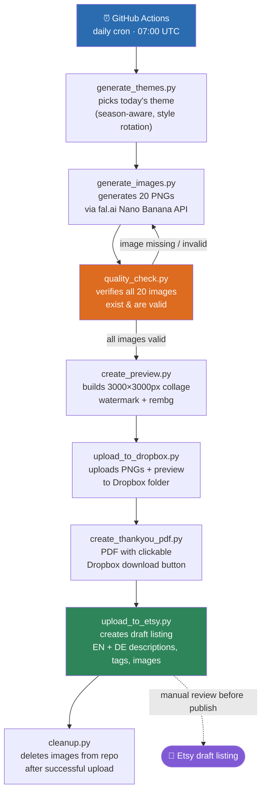

# Etsy Clipart Automation Pipeline

A fully automated pipeline that generates watercolor clipart bundles daily, creates product listings, and uploads them to Etsy — built with GitHub Actions, Python, and multiple AI APIs.

---

## Business Problem

Digital product creation for Etsy is repetitive and time-consuming. Creating artwork, building previews, writing SEO-optimized listing content in two languages, and publishing to the marketplace manually takes several hours every day.

## Solution

This pipeline automates the entire workflow end-to-end — from artwork generation to a ready-to-review Etsy draft listing — while keeping final quality control in human hands. The shop sells digital watercolor clipart PNG bundles and editable Canva templates. What used to take several hours of manual work now takes **15–20 minutes per day** (quality check and listing activation).

## Key Features

- ✅ Fully automated GitHub Actions pipeline (daily cron)
- ✅ AI-generated artwork with automated quality validation and retry logic
- ✅ Automatic multilingual (EN/DE) Etsy listing generation
- ✅ Dropbox integration for digital product delivery
- ✅ Manual review gate before publication (draft listings only)
- ✅ Self-cleaning repository (no accumulating storage)

---

## Architecture Overview



### Additional Workflows

| Workflow | Trigger | Purpose |
|---|---|---|
| `daily_themes.yml` | Daily cron 07:00 UTC | Main automated pipeline |
| `trigger_generation.yml` | Manual (workflow_dispatch) | Generate specific theme on demand |
| `manual_upload_action.yml` | Manual | Upload pre-made PNG packs |
| `template_upload_action.yml` | Manual | Upload Canva template listings |

---

## Script Reference

| Script | Purpose |
|---|---|
| `generate_themes.py` | Generates today's theme using Claude API with season-awareness and style rotation (Kawaii / Clean Watercolor / Silhouette) |
| `generate_images.py` | Calls fal.ai Nano Banana API to generate 20 PNGs with retry logic (3 attempts per image) |
| `quality_check.py` | Checks all expected images exist, are not empty, and have sufficient content pixels |
| `create_preview.py` | Creates 3000x3000px artistic collage with randomized rotation/sizing, watermark overlay, and rembg background removal |
| `upload_to_dropbox.py` | Uploads numbered PNGs + preview to Dropbox, returns shared folder URL |
| `create_thankyou_pdf.py` | Generates PDF with preview background and clickable download button linking to Dropbox |
| `upload_to_etsy.py` | Creates Etsy draft listing with Claude-generated SEO title, EN/DE descriptions, tags, and sample images |
| `cleanup.py` | Deletes image folders from GitHub after successful Etsy upload (keeps repo size small) |
| `manual_upload.py` | Uploads pre-made PNG packs from `uploads/` folder |
| `trigger_generation.py` | Generates images for a manually specified theme and style |
| `template_upload.py` | Creates Etsy listings for Canva templates with PDF containing the template link |

---

## Style System

The pipeline supports three visual styles with automatic rotation:

- **Kawaii** (every 6th run): Cute chibi characters with friendly faces — animals, fantasy creatures, characters
- **Clean Watercolor** (default): Realistic watercolor style with natural animal features, no cartoon expressions — objects, food, plants, realistic animals like flamingos
- **Silhouette** (every 10th run): Pure black flat shapes for Halloween and gothic themes

### Prompt Engineering: The Faces Problem

One of the most nuanced challenges was controlling whether subjects had faces or not.

**Initial approach**: Suppressing facial features across the board worked for inanimate objects but caused animals to generate without eyes — which looked broken and unprofessional.

**Solution**: Iterated on the prompt logic to allow natural animal features while still preventing cartoon-style expressions on inanimate objects, and kept a separate prompt profile for the Kawaii style where friendly faces are intentional.

Additionally, the theme generator was updated to explicitly separate themes: Kawaii runs always generate living creatures as subjects, Clean runs always generate objects or realistic animals — never mixing styles within a pack.

---

## Key Architecture Decisions

### Why GitHub Actions instead of a local cron job?
No server required, runs for free within GitHub's free tier, logs are accessible, and secrets are securely managed without any local configuration. The pipeline runs reliably at 07:00 UTC daily without any machine needing to be on.

### Why Dropbox instead of direct Etsy file upload?
Etsy has a 100MB file size limit per digital product. Twenty high-resolution 2K PNGs packaged into a PDF exceeded this limit (tested at 127MB). The solution: upload individual PNGs to a shared Dropbox folder and deliver a small PDF containing the download link.

### Why Quality Check before upload?
A broken or missing image in an Etsy listing leads to bad reviews and refund requests. The quality check verifies all 20 images exist and contain enough content pixels before any upload happens. Failed images trigger regeneration (up to 3 attempts).

### Why rembg only for the preview collage?
rembg (AI background removal) produces artifacts on fine details like fur, leaves, and thin branches when applied to source files. It is only used to create clean collage layouts in the preview image. The actual PNG files delivered to customers retain their original white backgrounds, which customers can remove themselves using Photoshop or similar tools.

### Why draft listings instead of direct publishing?
Every listing is created as a draft, allowing a manual review before going live. This catches any quality issues (wrong theme classification, broken images, incorrect descriptions) before customers see them.

---

## Stolpersteine / Major Hurdles

### Etsy API
- **App approval pending**: The Etsy developer app sat in "Pending" status for several days before being approved. No API calls are possible until approval.
- **Wrong x-api-key format**: The header requires `keystring:shared_secret` format — passing only the keystring causes 403 errors. This took multiple debugging sessions to discover.
- **Wrong shop endpoint**: `GET /application/shops` returns 403. The correct approach is fetching the user ID first via `/application/users/me` then the shop via the user ID. Ultimately hardcoded the shop ID for reliability.
- **Access token expiry**: Etsy access tokens expire after 3600 seconds (1 hour). Initial implementation broke every run. Solution: implemented automatic token refresh using the refresh token at the start of every upload.
- **OAuth scopes**: Required multiple iterations to find the correct scope set: `listings_w listings_r listings_d transactions_r shops_r email_r profile_r`
- **Shop language**: The shop was originally set to German, causing all listings to show in German by default and rank poorly internationally. Fixed by switching the shop primary language to English in Etsy settings.

### Dropbox
- **Generated access token expiry**: Dropbox "Generated access tokens" expire after 4 hours despite no warning in the UI. Required setting up a proper OAuth refresh token flow using a local Python script.
- **Permissions scope**: Initial token was missing `files.content.write` scope, causing upload failures.

### Pipeline Ordering
- **listing_today.json stale data**: The JSON file carrying state between pipeline steps contained data from the previous day's run. Fixed by deleting it at the start of each run in `generate_themes.py`.
- **Preview must come before Dropbox upload**: The preview image needs to be created before uploading to Dropbox so it can be included in the customer's download folder.
- **Thank You PDF needs Dropbox URL**: The PDF contains the Dropbox link, so Dropbox upload must complete before PDF creation.

### Image Generation
- **Nano Banana white backgrounds**: The model frequently generates images with white instead of transparent backgrounds. Used fal.ai's rembg API for post-processing, but this causes artifacts on complex subjects. Final decision: accept white backgrounds in source files, use rembg only for preview collage.
- **Missing images**: Occasionally the fal.ai API returns a 422 error for specific prompts, resulting in a missing file. Added 3-attempt retry logic in `generate_images.py` and a quality check that detects and regenerates missing images.
- **Style bleeding**: Early versions of the theme generator would sometimes assign a Kawaii run to an object-focused theme (e.g. "kawaii ice cream truck"), resulting in objects with cartoon faces. Fixed by strictly separating theme categories: Kawaii runs always use living creatures, Clean runs always use objects or realistic animals.

### GitHub
- **YAML indentation**: GitHub Actions YAML is extremely sensitive to indentation. A single space off causes cryptic errors like "No event triggers defined in on".
- **100MB file size limit**: High-resolution PNG files and large PDFs cannot be committed to GitHub. Solved by the cleanup script which removes all images after each successful upload.
- **Workflow permissions**: Default GitHub Actions permissions are read-only. Required enabling "Read and write permissions" in repository settings for the bot to commit results.

---

## Cost Breakdown

| Service | Cost |
|---|---|
| GitHub Actions | Free (within free tier limits) |
| fal.ai Nano Banana | ~$1.60/day for 20 images at $0.08/image |
| Anthropic Claude API | ~$0.05/day for descriptions and theme generation |
| Dropbox | Free plan (2GB) sufficient for testing and early operation |
| Etsy listing fee | $0.20 per listing (~$6/month for daily listings) |

**Total: approximately $55–60/month** for a fully automated daily listing pipeline.

*Costs represent the current development setup and may vary depending on usage volume and API pricing changes.*

---

## Setup Guide

Requires accounts at Anthropic, fal.ai, Dropbox (developer), and Etsy (developer), plus Python 3.11+ for local OAuth token generation.

1. Generate API keys for **Anthropic** and **fal.ai**
2. Generate OAuth refresh tokens for **Dropbox** and **Etsy** via the included local scripts (`get_dropbox_token.py`, `get_etsy_token.py` — Etsy requires developer app approval first, and scopes `listings_w listings_r listings_d transactions_r shops_r email_r profile_r`)
3. Add all credentials as **GitHub Secrets** (Settings → Secrets and variables → Actions):
   ```
   ANTHROPIC_API_KEY
   FAL_API_KEY
   DROPBOX_REFRESH_TOKEN
   DROPBOX_APP_KEY
   DROPBOX_APP_SECRET
   ETSY_KEYSTRING
   ETSY_SHARED_SECRET
   ETSY_ACCESS_TOKEN
   ETSY_REFRESH_TOKEN
   ETSY_SHOP_ID
   ```
4. Enable **"Read and write permissions"** under Settings → Actions → General → Workflow permissions
5. Add a `watermark.png` (3000×3000px, ~25% opacity) to the repository root

---

## Role of AI Assistance

This project was built using Claude as a pair-programming tool. Owned the product vision, architecture decisions, API strategy, and debugging — including diagnosing authentication failures, token-refresh logic across two APIs, and resolving pipeline ordering issues. Claude generated the initial code implementation based on these specifications, which was then tested, debugged, and iterated on in production.

This reflects how I expect to work in a professional environment: using AI as an engineering tool to accelerate implementation while taking full ownership of architecture, integration, troubleshooting, and the technical decisions that make systems reliable in production.

---

## Technologies Used

**Language**
- Python 3.11

**Automation / CI-CD**
- GitHub Actions (scheduling, orchestration, secrets management)

**AI**
- Claude API (theme generation, descriptions, tags, titles)
- fal.ai (image generation via Nano Banana model, background removal via rembg)

**APIs**
- Dropbox API (file storage and delivery)
- Etsy API v3 (listing management)

**Libraries**
- Pillow / NumPy (image processing)
- ReportLab (PDF generation)
- rembg (AI background removal for preview collage)
