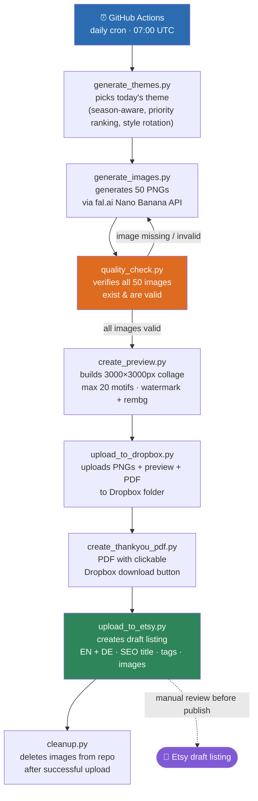

# Marketplace Automation Pipeline

A fully automated pipeline that generates watercolor clipart bundles daily, creates product listings, and uploads them to Etsy. Built with GitHub Actions, Python, and multiple AI APIs.

---

## Business Problem

Digital product creation for Etsy is repetitive and time-consuming. Creating artwork, building previews, writing SEO-optimized listing content in two languages, and publishing to the marketplace manually takes several hours every day.

## Solution

This pipeline automates the entire workflow end-to-end, from artwork generation to a ready-to-review Etsy draft listing, while keeping final quality control in human hands. The shop sells digital watercolor clipart PNG bundles and editable Canva templates. What used to take several hours of manual work now takes **15–20 minutes per day** (quality check and listing activation).

## Key Features

- ✅ Fully automated GitHub Actions pipeline (daily cron)
- ✅ AI-generated artwork with automated quality validation and retry logic
- ✅ Automatic multilingual (EN/DE) Etsy listing generation
- ✅ Dropbox integration for digital product delivery
- ✅ Manual review gate before publication (draft listings only)
- ✅ Self-cleaning repository (no accumulating storage)
- ✅ Claude Vision powered solo-listing creation with per-image SEO
- ✅ Priority theme system based on market research (Alura)
- ✅ Custom generation with 4 visual styles and 14 color palettes
- ✅ Mega pack and Canva template listing workflows

---

## Architecture Overview



### All Workflows

| Workflow | Trigger | Purpose |
|---|---|---|
| `daily_themes.yml` | Daily cron 07:00 UTC | Main automated pipeline |
| `trigger_generation.yml` | Manual (workflow_dispatch) | Generate specific theme + style on demand |
| `custom_generation.yml` | Manual | Generate with style + color palette selection |
| `manual_upload_action.yml` | Manual | Upload pre-made PNG packs from GitHub uploads/ folder |
| `template_upload_action.yml` | Manual | Upload Canva template listings with PDF |
| `megapack_action.yml` | Manual | Create mega bundle listing from Dropbox folder |
| `solo_listing_action.yml` | Manual | Create individual listings per PNG with Claude Vision |

---

## Script Reference

| Script | Purpose |
|---|---|
| `generate_themes.py` | Generates today's theme using Claude API with season-awareness, priority theme ranking, and style rotation (Kawaii / Clean Watercolor / Silhouette) |
| `generate_images.py` | Calls fal.ai Nano Banana API to generate 50 PNGs with 3-attempt retry logic per image |
| `quality_check.py` | Checks all expected images exist, are not empty, and have sufficient content pixels. Regenerates missing images automatically |
| `create_preview.py` | Creates 3000x3000px artistic collage from max 20 randomly selected motifs, with watermark overlay and rembg background removal |
| `upload_to_dropbox.py` | Uploads numbered PNGs + preview to Dropbox folder, returns shared folder URL |
| `create_thankyou_pdf.py` | Generates PDF with preview as background and clickable download button. Also uploads PDF to Dropbox |
| `upload_to_etsy.py` | Creates Etsy draft listing with Claude-generated SEO title (bestseller pattern), EN/DE descriptions with item keywords, 13 tags, and sample images |
| `cleanup.py` | Deletes image folders from GitHub after successful Etsy upload |
| `manual_upload.py` | Uploads pre-made PNG packs from uploads/ folder, generates preview and listing |
| `trigger_generation.py` | Generates images for a manually specified theme and style |
| `custom_generation.py` | Generates images with full style and color palette control (4 styles, 14 palettes) |
| `template_upload.py` | Creates Etsy listings for Canva templates with Thank You PDF containing the template link |
| `megapack_listing.py` | Creates mega bundle listings from existing Dropbox folders. Counts PNGs automatically, generates simple title-only preview |
| `solo_listing.py` | Downloads selected PNGs from Dropbox, uses Claude Vision to identify each motif, generates individual SEO title + EN/DE description + tags per image, creates white-background preview with watermark, uploads PNG as direct digital download |

---

## Style System

The pipeline supports four visual styles:

- **Kawaii** (every 6th run): Cute chibi characters with friendly faces: animals, fantasy creatures, characters
- **Clean Watercolor** (default): Realistic watercolor style with natural animal features, no cartoon expressions: objects, food, plants, realistic animals
- **Silhouette** (every 10th run): Pure black flat shapes for Halloween and gothic themes
- **Comic-Kindlich** (manual only): Children's book illustration style with bold outlines and flat colors, for vehicles, farm animals, etc.

### Color Palette System (Custom Generation)

14 predefined palettes selectable per run: `neutral`, `pastel`, `baby-pink`, `baby-blue`, `fire-red`, `eucalyptus`, `butterlemon`, `moody-autumn`, `gold-cream`, `citrus`, `navy`, `dark-gothic`, `coffee-faded`, `teal-orange`

### Priority Theme System

Themes are ranked by market research and stored in `themes.json` under `priority_themes`. The daily pipeline works through this ranked list automatically, ensuring the highest-potential themes are generated first. After priority themes are exhausted, the pipeline falls back to `seed_themes`.

### Prompt Engineering: The Faces Problem

One of the most nuanced challenges was controlling whether subjects had faces or not.

**Initial approach**: Suppressing facial features across the board worked for inanimate objects but caused animals to generate without eyes, which looked broken and unprofessional.

**Solution**: Iterated on the prompt logic to allow natural animal features while still preventing cartoon-style expressions on inanimate objects, and kept a separate prompt profile for the Kawaii style where friendly faces are intentional.

Additionally, the theme generator was updated to explicitly separate themes: Kawaii runs always generate living creatures as subjects, Clean runs always generate objects or realistic animals, never mixing styles within a pack.

---

## Solo Listing Pipeline

The solo listing workflow enables rapid portfolio growth by turning one 50-image pack into 50 individual listings, each with unique AI-generated content.

**Workflow:**
1. Review the pack in Dropbox, select the best images (e.g. `01,05,12,23,34`)
2. Trigger `solo_listing_action.yml` with Dropbox folder path, theme, image numbers, and price
3. For each selected image:
   - Downloads PNG from Dropbox
   - Creates preview with white background + watermark overlay
   - Claude Vision analyzes the image to identify the exact motif
   - Generates individual SEO title, long EN description, German translation, and 13 tags
   - Uploads PNG as direct Etsy digital download (no PDF needed)
   - Creates draft listing

**Portfolio math:** 10 packs × 20 solo listings = 200 additional listings. Etsy rewards shops with more listings through broader search coverage.

---

## Key Architecture Decisions

### Why GitHub Actions instead of a local cron job?
No server required, runs for free within GitHub's free tier, logs are accessible, and secrets are securely managed without any local configuration.

### Why Dropbox instead of direct Etsy file upload?
Etsy has a 100MB file size limit per digital product. Fifty high-resolution 2K PNGs exceeded this limit. Solution: upload individual PNGs to a shared Dropbox folder and deliver a small PDF with the download link.

### Why 50 images per pack?
Market research (Alura) showed bestselling packs contain 100-250+ images at similar price points. Moving from 20 to 50 images significantly improves perceived value and conversion rates.

### Why Quality Check before upload?
A broken or missing image in an Etsy listing leads to bad reviews and refund requests. The quality check verifies all 50 images exist and contain enough content pixels before any upload happens.

### Why rembg only for the preview collage?
rembg produces artifacts on fine details like fur, leaves, and thin branches. It is only used to create clean collage layouts in the preview. Actual PNG files delivered to customers retain white backgrounds for manual removal via Photoshop.

### Why draft listings instead of direct publishing?
Every listing is created as a draft, allowing manual review before going live. This catches quality issues before customers see them.

### Why Claude Vision for solo listings?
Manual title creation for 50 individual images per pack would take hours. Claude Vision identifies each motif automatically and generates contextually accurate, SEO-optimized content specific to what is actually in each image, not just the pack theme.

---

## Major Hurdles

### Etsy API
- **App approval pending**: The Etsy developer app sat in "Pending" status for several days. No API calls possible until approval.
- **Wrong x-api-key format**: Header requires `keystring:shared_secret` format. Passing only the keystring causes 403 errors.
- **Wrong shop endpoint**: `GET /application/shops` returns 403. Hardcoded shop ID for reliability.
- **Access token expiry**: Tokens expire after 3600 seconds. Implemented automatic refresh at the start of every upload.
- **OAuth scopes**: Multiple iterations required: `listings_w listings_r listings_d transactions_r shops_r email_r profile_r`
- **Shop language**: Originally German, causing poor international ranking. Fixed by switching primary language to English.
- **Title validation**: Etsy rejects titles starting with quotes. Added `.strip('"').strip("'")` to all title generation.

### Dropbox
- **Generated access token expiry**: Tokens expire after 4 hours. Required OAuth refresh token flow.
- **Path vs share link confusion**: Dropbox API requires internal paths like `/folder/subfolder`, not browser URLs.

### Pipeline Ordering
- **listing_today.json stale data**: State file from previous run caused wrong themes and titles. Fixed by deleting at start of each run.
- **Preview must come before Dropbox upload**: Preview must exist before uploading so it can be included in the customer folder.
- **Thank You PDF needs Dropbox URL**: PDF contains the download link, so Dropbox upload must complete first.

### Image Generation
- **Nano Banana white backgrounds**: Model generates white instead of transparent backgrounds. Accepted for source files, rembg used only for preview collage.
- **Missing images on 422 errors**: fal.ai occasionally returns 422 for specific prompts. Added 3-attempt retry in generate_images.py and quality check regeneration.
- **Style bleeding**: Theme generator would assign Kawaii runs to object-focused themes. Fixed by strictly separating theme categories.
- **50 item prompt truncation**: Increasing to 50 images caused Claude to truncate the JSON item list. Fixed by increasing max_tokens to 2000.

### JSON
- **Long descriptions breaking JSON**: Embedding 500-word descriptions inside JSON caused parsing failures due to special characters and newlines. Fixed by separating image analysis (short JSON) from description generation (separate API calls).
- **themes.json comma errors**: Manual editing of themes.json caused JSON parse errors that stopped the entire pipeline. Added validation reminder to always check jsonlint.com after manual edits.

### GitHub
- **YAML indentation**: GitHub Actions YAML is extremely sensitive to indentation.
- **100MB file size limit**: Solved by cleanup script removing all images after successful upload.
- **Workflow permissions**: Required enabling "Read and write permissions" in repository settings.

---

## Cost Breakdown

| Service | Cost |
|---|---|
| GitHub Actions | Free (within free tier limits) |
| fal.ai Nano Banana | ~$4.00/day for 50 images at $0.08/image |
| Anthropic Claude API | ~$0.10–0.20/day (descriptions, vision, themes) |
| Dropbox | Free plan sufficient for current volume |
| Etsy listing fee | $0.20 per listing |
| Etsy Ads | Optional, ~$2–5/day during ramp-up |

**Daily pipeline: ~$4.20/day**
**Solo listings: ~$0.40 per pack (API) + $0.20 per listing (Etsy)**

---

## Setup Guide

Requires accounts at Anthropic, fal.ai, Dropbox (developer), and Etsy (developer), plus Python 3.11+ for local OAuth token generation.

1. Generate API keys for **Anthropic** and **fal.ai**
2. Generate OAuth refresh tokens for **Dropbox** and **Etsy** via the included local scripts (`get_dropbox_token.py`, `get_etsy_token.py`)
3. Add all credentials as **GitHub Secrets**:
   ```
   ANTHROPIC_API_KEY
   FAL_API_KEY
   DROPBOX_REFRESH_TOKEN
   DROPBOX_APP_KEY
   DROPBOX_APP_SECRET
   ETSY_KEYSTRING
   ETSY_SHARED_SECRET
   ETSY_ACCESS_TOKEN
   ETSY_REFRESH_TOKEN
   ETSY_SHOP_ID
   ```
4. Enable **"Read and write permissions"** under Settings → Actions → General → Workflow permissions
5. Add a `watermark.png` (3000×3000px, ~25% opacity) to the repository root
6. Configure `themes.json` with your priority themes and seed themes

---

## Role of AI Assistance

This project was built using Claude as a pair-programming tool. Owned the product vision, architecture decisions, API strategy, market research integration, and debugging, including diagnosing authentication failures, token-refresh logic across three APIs, pipeline ordering issues, and JSON parsing edge cases. Claude generated the initial code implementation based on these specifications, which was then tested, debugged, and iterated on in production.

This reflects how I expect to work in a professional environment: using AI as an engineering tool to accelerate implementation while taking full ownership of architecture, integration, troubleshooting, and the technical decisions that make systems reliable in production.

---

## Technologies Used

**Language**
- Python 3.11

**Automation / CI-CD**
- GitHub Actions (scheduling, orchestration, secrets management)

**AI**
- Claude API (theme generation, descriptions, tags, titles, Vision image analysis)
- fal.ai (image generation via Nano Banana model, background removal via rembg)

**APIs**
- Dropbox API (file storage and customer delivery)
- Etsy API v3 (listing management)

**Libraries**
- Pillow / NumPy (image processing, preview generation)
- ReportLab (PDF generation)
- rembg (AI background removal for preview collage)
